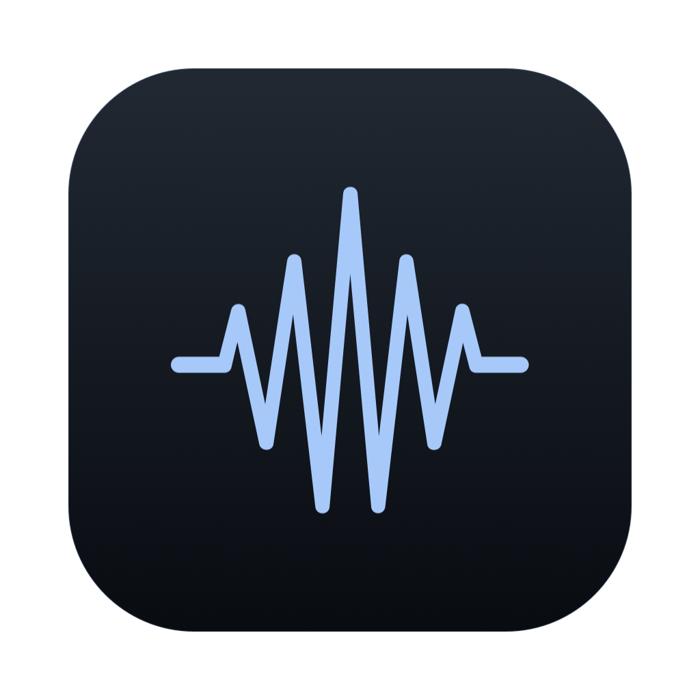
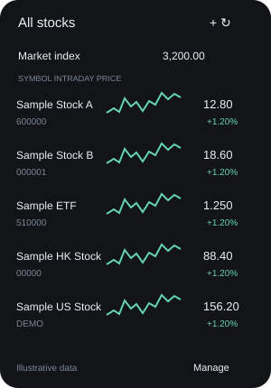
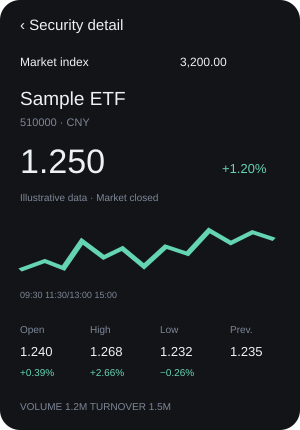
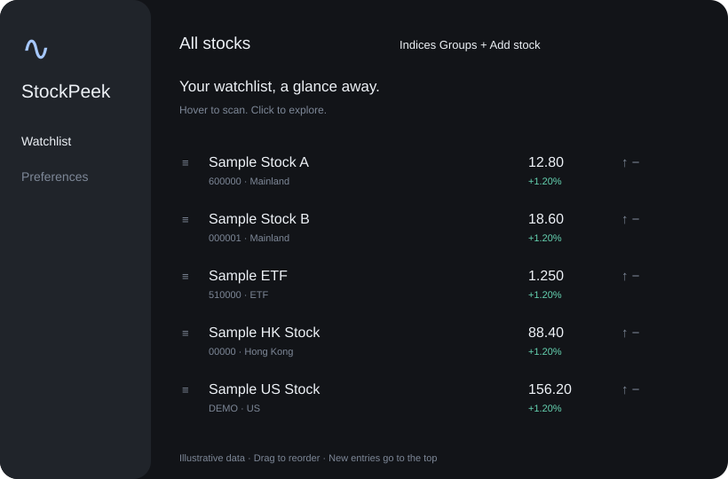

<div align="center">
  
  <h1>StockPeek</h1>
  <p><strong>抬眼之间，关注所选。</strong></p>
  <p>为 Apple Silicon Mac 打造的轻巧股票、ETF 与大盘指数监控应用。</p>
  <p>macOS 26+ · Apple Silicon · SwiftUI · 预览版</p>
  <p><a href="README.md">English</a> · <strong>简体中文</strong></p>
  <p><a href="https://github.com/mayunaise/stockpeek/releases">下载安装</a> · <a href="#效果预览">效果预览</a> · <a href="#功能介绍">功能介绍</a> · <a href="#构建与测试">本地构建</a></p>
</div>

StockPeek 将行情放进小巧的菜单栏轮播条。鼠标悬停即可浏览自选股和分时走势，点击证券查看详细数据。深色半透明界面减少视觉干扰，让注意力留在行情本身。

使用 SwiftUI、AppKit 和 Charts 原生构建，无第三方运行时依赖。当前应用界面为简体中文，项目文档提供中英文版本。

## 效果预览

<table>
  <tr><th>悬停查看自选</th><th>点击深入详情</th></tr>
  <tr>
    <td align="center"></td>
    <td align="center"></td>
  </tr>
</table>

<p align="center"></p>

以上为根据应用布局绘制的界面示意图，使用虚构证券与价格，不是实时截图，也不构成推荐。示意图采用英文标签，当前应用实际界面为简体中文。

## 运行要求

- Apple Silicon Mac
- macOS 26 或更新版本
- 本地构建需要 Swift 工具链与 macOS 26 SDK（Xcode 或兼容的 Command Line Tools）

## 下载与安装

1. 前往 [Releases](https://github.com/mayunaise/stockpeek/releases)，下载 Apple Silicon 版 DMG。
2. 打开磁盘映像，将 **StockPeek.app** 拖入 Applications（应用程序）。
3. 启动 StockPeek，添加自选，鼠标悬停菜单栏行情条即可查看。

当前预览版使用临时签名（ad-hoc），尚未使用 Developer ID 签名或通过 Apple 公证。macOS 可能拦截下载的应用，也可以按下方步骤从源码构建。关闭管理窗口后，应用仍会在菜单栏运行。

## 功能介绍

### 小巧常驻，悬停即看

菜单栏按设定间隔轮播证券，长名称自动滚动，不额外挤占菜单栏空间。数据暂未更新时保留最近价格。悬停展开自选列表，点击进入详情，两级页面保持一致的 300 × 430 pt 尺寸。

### 自选分组，按你的习惯排列

最多支持 500 只自选。新增时勾选所属分组，同一证券可以加入多个分组。股票与分组均支持拖动排序、快捷置顶，新增证券默认置顶。悬浮页面也提供快速添加入口，右键列表中的证券或点击详情页的减号图标即可移出自选，空分组显示引导提示。

### 分时走势与大盘指数

一级列表直接展示各证券的分时图，详情页展示当前价格、涨跌额、涨跌幅、来源与时间，以及今开、最高、最低、昨收、成交量和成交额。今开、最高、最低同时显示相对昨收的百分比。

独立指数轮播条支持自定义最多 20 个受支持指数、调整顺序与查看详情，让个股和大盘可以一起关注。

### 能力一览

| 功能 | 支持情况 |
| --- | --- |
| 市场覆盖 | 沪深 A 股、北交所、港股、美股及 ETF，具体证券以数据源支持为准 |
| 证券搜索 | 名称、代码及支持的拼音首字母 |
| 行情来源 | 东方财富、腾讯财经，可配置优先来源与备用切换 |
| 外观设置 | 轮播间隔、涨跌颜色、减少动态效果等 |
| 分时坐标 | 使用交易所当地时间，美股适配纽约夏令时 |
| 午间休市 | A 股与港股午休压缩显示，避免图中出现长段空白 |
| A 股盘后 | 分时图截止 15:00，不纳入盘后交易 |
| 休市与启动 | 休市停止常规轮询，保留快照，启动时仍请求一次报价 |

### 常用操作

| 操作 | 效果 |
| --- | --- |
| 悬停菜单栏行情条 | 打开当前分组的自选列表 |
| 点击证券 | 进入详情页 |
| 详情页点击减号图标，或右键点击列表中的证券 | 将该股票移出自选 |
| 点击固定图标 | 保持悬浮页面展开 |
| 鼠标移开 | 收起未固定的页面 |
| 应用激活时按 ⌘D | 打开并固定自选面板 |
| ⌘1 | 打开管理窗口 |
| 面板获得焦点时按 Escape | 先返回列表，再关闭面板 |

从管理窗口打开个股详情不会自动固定悬浮页面。

## 行情来源与刷新规则

当前接入东方财富、腾讯财经的公开 Web 行情接口，支持优先来源及失败备用切换。腾讯数字代码港股报价使用 `r_hk` 接口，分时图使用独立接口，两者延迟可能不同。**同花顺 iFinD 与 Wind 尚未接入**，使用这些服务需要相应授权。

| 数据 | 刷新方式 |
| --- | --- |
| 报价 | 每批最多 50 只，交易时段每轮完成后约 5 秒进入下一轮 |
| 分时图 | 按需加载，最多 6 个并发请求，约 30 秒刷新一次 |
| 应用启动 | 先恢复本地快照，再请求一次报价，休市时也执行 |
| 首次显示分时图 | 可请求一次；A 股收盘后已有当日缓存则不再更新 |
| 非交易时段 | 停止常规轮询，开市后自动恢复 |

当前按工作日及以下交易所当地时间判断交易窗口：

| 市场 | 时间窗口 |
| --- | --- |
| A 股 / 内地市场 | 09:30–11:30、13:00–15:00 |
| 港股 | 09:30–12:00、13:00–16:10 |
| 美股 | 纽约时间 09:30–16:00 |

尚未接入节假日、半日市、临时休市及个股停牌日历。刷新频率不代表数据源实时性保证，接口可能延迟、不可用或发生变更。应用保留实际来源和时间戳，不使用模拟价格作为备用数据。

这些接口适配不等同于授权商业行情服务，也不代表交易所授权、可用性保证或数据再分发许可。应用不提供交易下单或投资建议。

## 构建与测试

在项目根目录执行：

```bash
bash scripts/test.sh
bash scripts/build.sh
open 'build/StockPeek.app'
```

启动新构建前，请先退出正在运行的旧实例。生成 DMG 安装映像及 SHA-256 校验文件：

```bash
bash scripts/package-release.sh
```

可选的在线接口验证（会访问公开行情服务）：

```bash
bash scripts/live-smoke.sh
bash scripts/global-live-smoke.sh
```

## 本地存储与隐私

为兼容早期开发版本，内部 Bundle ID 保留为 `com.wayne.notchstocks.demo`，数据目录保留为 `~/Library/Application Support/NotchStocks/`。应用显示名称与可执行文件名称均为 **StockPeek**。

| 数据 | 保存位置 |
| --- | --- |
| 自选、分组、排序 | 数据目录下的 `watchlist.json` |
| 最近报价与对应分时图 | 数据目录下的 `watchlist.market-snapshot.json` |
| 偏好、所选指数与指数快照 | 对应 Bundle ID 的 macOS UserDefaults |

快照覆盖旧内容，不会随使用不断追加历史记录。股票快照正常写入最多每 15 秒一次，正常退出时保存待写数据。股票快照限制为 32 MB，指数快照限制为 2 MB；无效或不匹配的缓存会被跳过。

应用会将查询的证券代码和搜索文本发送给行情服务，无应用账号、分析 SDK 或文件上传功能。个人存储文件、偏好、缓存及构建产物不提交到源码仓库；文档包含使用虚构证券的界面示意图。

## 项目结构

```text
Sources/    原生应用、状态管理、持久化、图表与行情接口
Tests/      离线回归测试及小型公开响应样本
Assets/     波形应用图标、界面示意图与图标生成说明
scripts/    构建、测试、打包与可选在线检查
```

应用图标沿用界面中的波形符号，详见 [图标说明](Assets/README.md)。

## 当前状态与反馈

当前为 **v0.2.0 早期预览版**。多显示器、长期能耗与全屏交互仍需更多验证。尚不包含价格提醒、开机启动、交易下单或授权商业行情源。

欢迎通过 [GitHub Issues](https://github.com/mayunaise/stockpeek/issues) 反馈问题或提出建议。行情和图表问题请附证券代码、市场、来源时间、macOS 版本及复现步骤；上传截图前请移除个人信息。

版本变化见 [CHANGELOG.md](CHANGELOG.md)，当前预览版说明见 [release notes](docs/release-notes.md)。

## 许可证

StockPeek 采用 [MIT 许可证](LICENSE)，允许按许可条款商用、修改和分发。该许可证不授予第三方行情数据或服务的使用及再分发权利。
